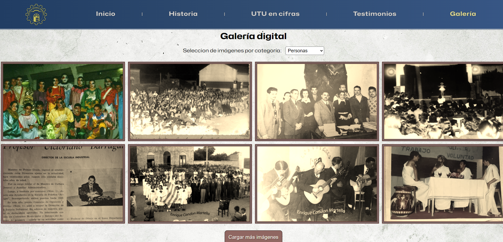

## 🌎Aló Earth🌍
### 🙋🏻 I'm Juan Diego

****`Full Stack Web Developer`****
-
- ✅ Self-taught
- 🧠 Creator of solutions through logical thinking
- ♟️ I like playing chess

---
### 🧰 Languages and Tools

<!---
<!---
<!---
<!--- 
<!---
<!---  -->

 

---
# 📺 Some Projects

📘 Escuela Técnica Trinidad 📘

 

   
   
   
   

---

🍃 Nutri4Well 🍃

 

   
   
   
   

---

🔫 Key Drop clone 🔫

 

   
   

---

🌘 Star Wars Blog 🌒

 

   
   

---
### 📊 Stats

---

   
   <a href="https://www.linkedin.com/in/juan-diego-elissalde-gudef%C3%ADn-4248422b8/">
      Let's Connect on Linkedin.
   </a>

   
   <a href="https://www.linkedin.com/in/juan-diego-elissalde-gudef%C3%ADn-4248422b8/">
      Gmail.
   </a>

